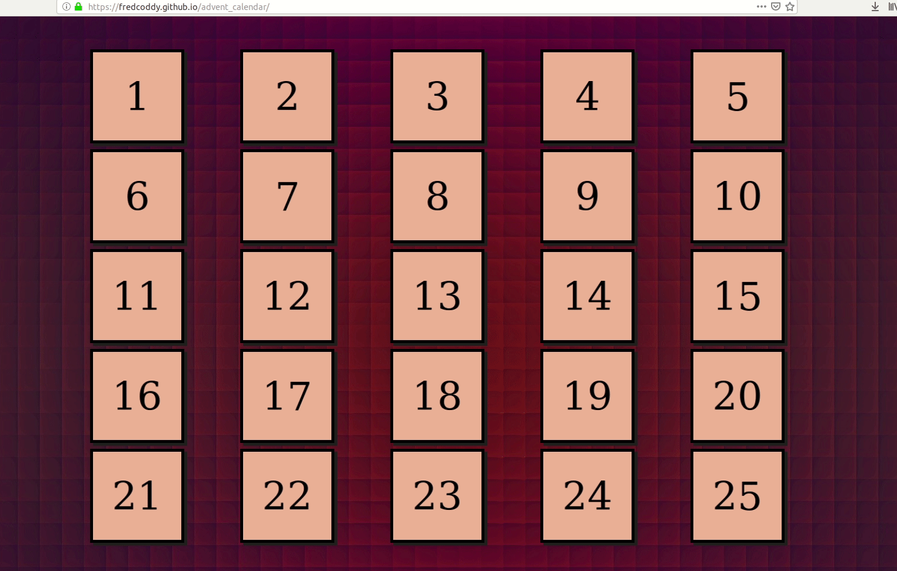

# ADVENT CALENDAR 🎄🎅🤶🎄 

JUNG Frédéric : frederic.jung@etu.u-bordeaux.fr

## Tutorial: develop a christmas calendar.

Purpose of this exercise:

- implement JavaScript events 
- use code versionning tools
- learn to use web CSS/JavaScript libraries

This exercice is typical [nuit de l'info](https://www.nuitdelinfo.com/) contest project. Feel free to create your own advent calendar using your favorite CSS/JavaScript libraries.

My own calendar: https://fredcoddy.github.io/advent_calendar/

_______

## Dependencies:

- [Tilt JS](https://gijsroge.github.io/tilt.js/)
- [JQuery](https://jquery.com/)
- [Snowstorm](http://www.schillmania.com/projects/snowstorm/)
